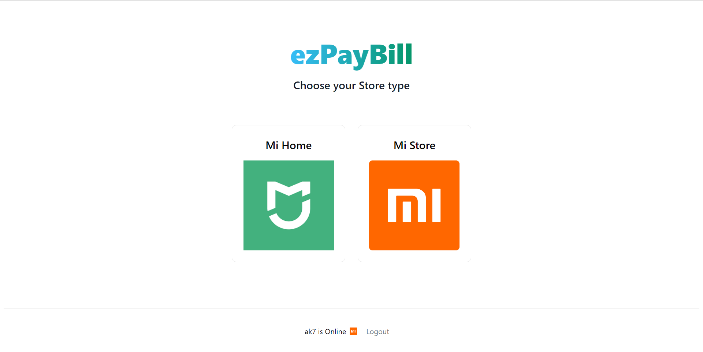

<div id="top"></div>
<br />
<div align="center">


<h2 align="center">ezPayBill</h3>

  <p align="center">
    A billing app integrated across all devices and outlets to be used by the Mi's vendor/operator at the Point of Sale (POS), built for Xiaomi Ode2Code 2.0.
    <br />
 
  </p>
</div>


<!-- TABLE OF CONTENTS -->
<details open>
  <summary>Table of Contents</summary>
  <ol>
    <li>
      <a href="#about">About app</a>
      <ul>
        <li><a href="#built-with">Built With</a></li>
      </ul>
    </li>
    <li>
      <a href="#getting-started">Getting Started</a>
      <ul>
        <li><a href="#for-windows">Windows Installation</a></li>
        <li><a href="#for-android">Android Installation</a></li>
      </ul>
    </li>
    <li><a href="#usage">Usage</a></li>
    <li><a href="#note">Note</a></li>

  </ol>
</details>

## About



This app eases out the billing process across all Mi outlets by allowing the store operators to process
client orders in real-time through both desktop and mobile applications thereby increasing speed and
efficiency and ultimately, client experience.


<p align="right">(<a href="#top">back to top</a>)</p>


### Built With

- [NextJS](https://nextjs.org/)
- [ElectronJS](https://www.electronjs.org/)
- [Capacitor](https://capacitorjs.com/)
- [Firebase](https://firebase.google.com/)
- [Framer Motion](https://www.framer.com/motion/)
- [Tailwind CSS](https://tailwindcss.com/)
- [PayTM Payments API](https://business.paytm.com/docs)
- [Nodemailer](https://nodemailer.com/about/)
<p align="right">(<a href="#top">back to top</a>)</p>

<!-- GETTING STARTED -->
## Getting Started

This application supports both Windows and Android platforms. To get started, follow these instructions.

### For Windows 
1. Download from [here](https://drive.google.com/file/d/16imtHgwCXG3wpuoS_0dBV6nNfwVpPZxx/view?usp=sharing) and run the installer.
2. Wait for the installer window to close even if the application opens by itself. Once the installer closes, the app is ready to use.
3. If the app is closed by mistake, you can always find it in `C:\Users\<your-pcname>\AppData\Local\ezpaybill\ezpaybill.exe` to open again. Make sure to enable hidden items option in file explorer settings to view the folders.

### For Android 
1. Download and install `ezpaybill.apk` from the repository to your Android device and launch the app.


<p align="right">(<a href="#top">back to top</a>)</p>

## Usage
1. Create an account or login to the app.
2. Choose a store type (either Mi Home or Mi Store).
3. Enter your store operator details.
4. Choose a product category and add them to cart.
5. You can also modify quantity and color of the product.
6. Once your products are added to the cart, click checkout to proceed further.
7. Enter client's operator store details and their email ID where the invoice can be later sent to as a PDF.
8. Upon submitting the client's details, you can review the order details before placing the order.
9. Upon going placing the order, click on proceed to pay to open the PayTM gateway.
10. Complete the sandbox payment process using either Net Banking or Debit/Credit card. Given below is a dummy card that can be used to complete payment if card payment option is chosen.
``` sh
Card Number: 4111-1111-1111-1111
Expiry: 12/23
CVV: 123
```
11. Upon completing the sandbox payment process, you can view this order and previous orders in `Your Orders` page.
12. Click `Get Invoice` to the order you wish to see its invoice.
13. Upon moving to next page click `Get Invoice` to download the invoice locally as a PDF and also send its copy via entered Email ID.
14. Check the recieved email in your spam folder.
15. Light and Dark modes can be toggled from the footer according to your preference.

## Note
This app can be run in both online and offline modes. In the login page, if the app can't connect to the internet then it will proceed to run in offline mode.
### Online mode
1. All your past orders and invoices are stored in a cloud database which can be accessed at any time and any device.
2. All above features are available including online payment support, invoice report and email support.
### Offline mode
1. Your orders are stored locally on the device and app can function normally, however online features such as payment, invoice and email support are not available.
<p align="right">(<a href="#top">back to top</a>)</p>

                            
